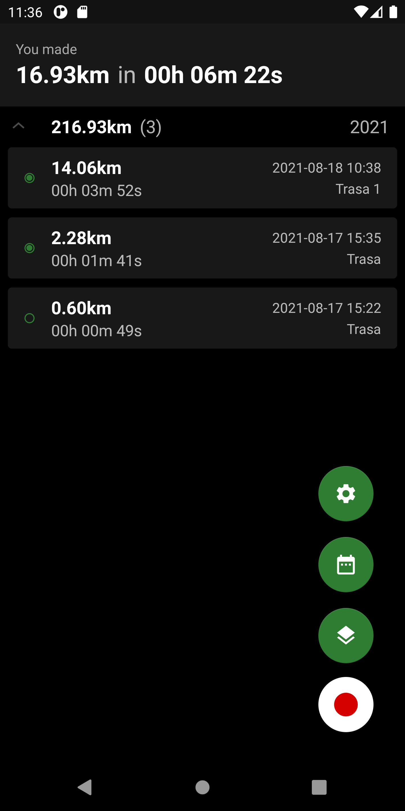

## Geo Tracker
Application used to track your routes in the background. Just start the app, wait until GPS will obatin your position and start tracking. App will work when is in background or screen is off. 

Functions:
* Recorded tracks are groupped by year.
* From the notification you can view actual status with distance made. 
* You can view all tracks on the map.
* In the calendar view you can track distance in each day and month.
* From the settings you can made a backup and restore stored data.
* Track view contains summary, map with made route and speed and altitude chart.

Project uses newest Android components like:
* Hilt
* Room
* ViewModel
* Navigation
* Jetpack Paging
* Startup

 

